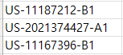
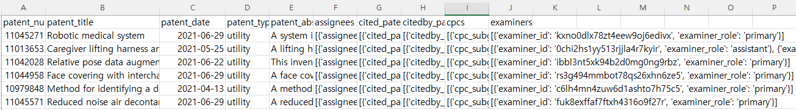
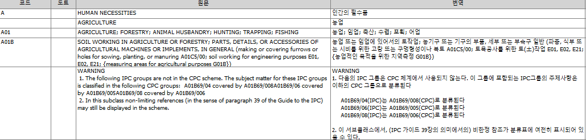
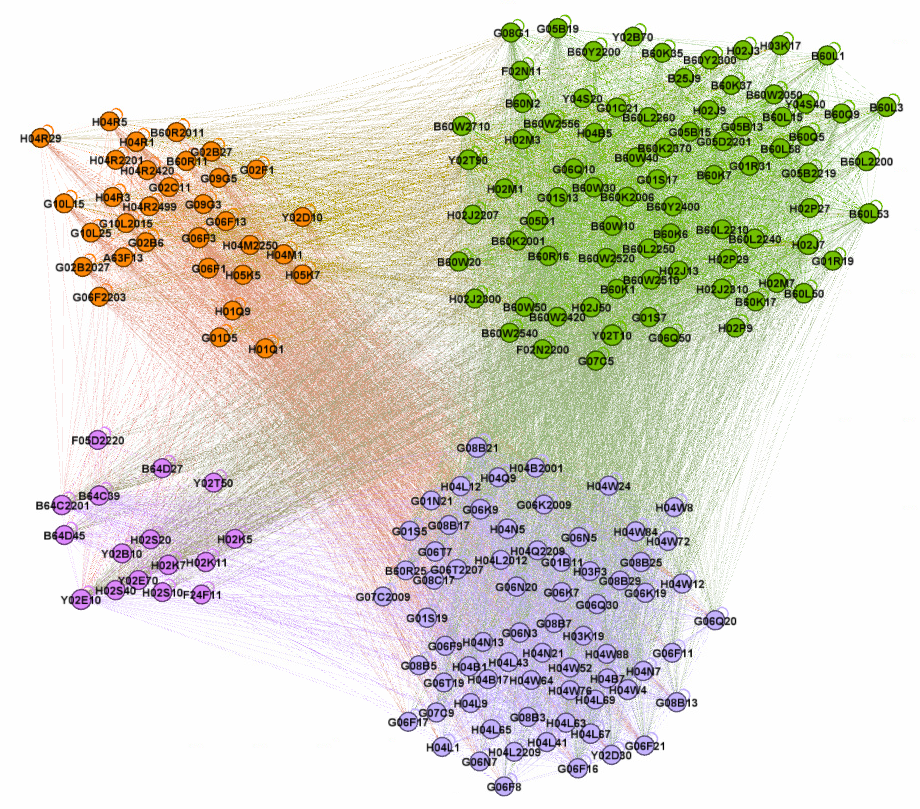
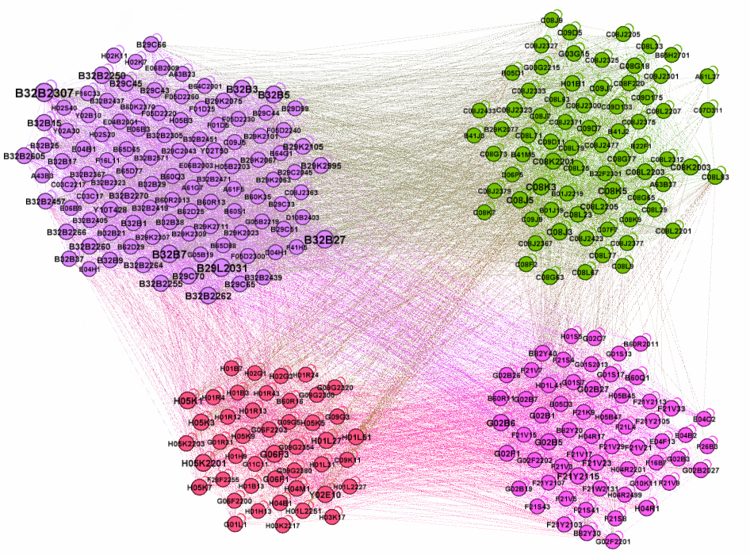
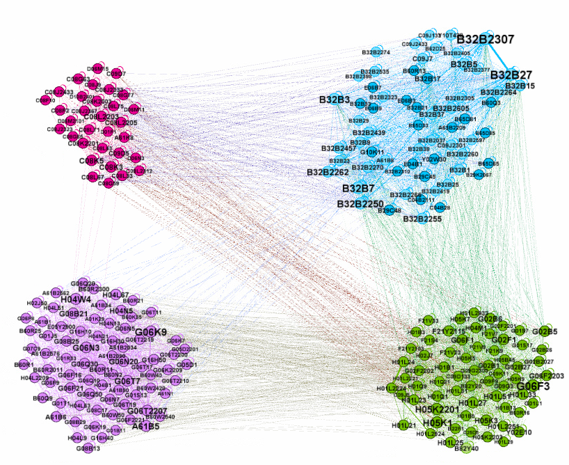

# 데이터분석기반의 전자제조 전문인력 양성사업단 2021년 하반기 산학협력 프로젝트

## 참가자

### 서울과학기술대학교 

박영준, 김종백

### 숙명여자대학교 

원다영, 오경은

## Keyword 탐색

- 분석 요청 업체와 경쟁사들의 주요 기술 및 제품들을 기반으로 추출
    - 경쟁사 분석 - 침해여부를 중심으로 회피설계 방법
    - 소재 중심으로 분석
    - 동종기술 특허조사 위주로 분석

## 데이터 크롤링

### Keyword기반 크롤링

- 사전에 입력받은 키워드를 바탕으로 Google Patent의 데이터를 Selenium을 활용하여 크롤링
    - Google Patent의 데이터를 파일화하는 것은 50,000건이 최대이므로, period를 산정할 때 limit에 걸리지 않게 주의할 것.
- 크롤링한 후 특허 데이터로 활용 가능한 것들의 코드만을 추출하여 list화

```python
search_text = 'electronic battery' #검색 키워드
search_period = [
                    ['20180101','20180331'], ['20180401', '20180630'],['20180701','20180930'], ['20181001', '20181231'],        
                    ['20190101','20190331'], ['20190401', '20190630'],['20190701','20190930'], ['20191001', '20191231'],
                    ['20200101','20200331'], ['20200401', '20200630'],['20200701','20200930'], ['20201001', '20201231'],
                    ['20210101','20210331'], ['20210401', '20210630'],['20210701','20210930'], ['20211001', '20211231'],
                ] #분기별로 구간 분리

for length in search_period:
    begin_date = length[0]
    end_date = length[1]
    driver.get(f'https://patents.google.com/?q={search_text}&country=US&before=priority:{end_date}&after=priority:{begin_date}&language=ENGLISH') 
    time.sleep(15) # 429(Too many Requests Error)를 방지
    driver.find_element_by_xpath('//*[@id="count"]/div[1]/span[2]/a').click() # 페이지 내의 csv 파일 다운로드 링크 클릭
```

### 유효 코드 추출 및 저장

- code값은 끝의 알파벳이 'B+숫자'로 끝나는 형태로 된 코드의 가운데 부분의 숫자코드만을 필요로 함
    - 아래 사진의 경우 1187212, 11167396만을 가져와야 함
    - 코드의 맨 앞은 특허 출원국인 US로 고정되어 있으므로, 우리는 텍스트에서 'B'를 포함하는지의 여부만을 확인하면 됨



```python
code_dict = dict() ## 키워드별로 해당되는 코드
for search_text in search_text_list:
    path = f"./crawling_files/{search_text}/"
    file_list = os.listdir(path)
    code_list = []
    for file in file_list:
        df = pd.read_csv(f'./crawling_files/{search_text}/{file}', header=1) ## 해당 파일의 2번째 줄부터를 DataFrame화 함. 
        																	 ## 첫 줄에는 검색 URL이 기본적으로 작성되어 있음
        for i in range(len(df)):
            id_txt = df['id'][i]
            if 'B' in id_txt: ## 텍스트에서 B를 포함하는지의 여부
                code_list.append(id_txt.split('-')[1])
    code_dict[f'{search_text}'] = code_list # 저장된 데이터를 dict에 삽입
```

- 완성된 dict는 pickle화하여 파일 형태로 보존

```python
import pickle

with open('code.pickle', 'wb') as fw:
    pickle.dump(code_dict, fw)
```

### USPTO 데이터 크롤링

- pickle에 담겨 있는 dict의 value를 토대로 USPTO에서 크롤링 진행
- 크롤링 결과의 예시



## CPC 분리 
- cpcs column에 묶여있는 cpc 분리
- cpc_subgroup_id까지 network 분석 대상으로 정함

```python
path_dir = './electronic_manufacture_2021-main/patent_data/patent/' #수집된 특허데이터 경로 설정
file_list = os.listdir(path_dir)

for j in file_list:  
    data = pd.read_csv("./electronic_manufacture_2021-main/patent_data/patent/"+j) #데이터 import
    cpc_sets=[]
    sample = data['cpcs'].to_list()
    for i in sample:
        cpc_set = ''
        i = pd.DataFrame(eval(i))
        for c in i['cpc_subgroup_id']:
            try:
                cpc = c.split('/')[0]
                cpc_set = cpc_set +','+ cpc
            except:
                cpc_set = cpc_set + 'None'
        cpc_sets.append(cpc_set)
    data['cpc_set'] = cpc_sets
    data['cpc_set'] = data['cpc_set'].str.lstrip(",")
    data.to_csv('./electronic_manufacture_2021-main/patent_data/cpc_devide/cpc_'+j, encoding='utf8', index=False) #CPC 분리후 csv 파일로 저장
```
## 네트워크 분석을 위한 cpc동시 출현 matrix
- 특허 = 문서, cpc = 단어로 규정하여 tf-idf 기반의 동시출현 matrix 도출
```python
import pandas as pd
import numpy as np
from sklearn.feature_extraction.text import CountVectorizer


path_dir = './electronic_manufacture_2021-main/patent_data/cpc_devide/'
file_list = os.listdir(path_dir)

for i in file_list:    
    data = pd.read_csv("./electronic_manufacture_2021-main/patent_data/cpc_devide/"+i)
    
    cpc_list = data['cpc_set']
    
    vect = CountVectorizer()
    document_term_matrix = vect.fit_transform(cpc_list) 
    
    tf = pd.DataFrame(document_term_matrix.toarray(), columns=vect.get_feature_names()) #tf계산
    
    D = len(tf)
    df = tf.astype(bool).sum(axis=0)
    idf = np.log((D+1) / (df+1)) + 1  #idf 계산
    
    tfidf = tf * idf                      
    tfidf_array = tfidf.to_numpy() #tf-idf 
    
    co_mat = np.dot(tfidf_array.T, tfidf_array) #coocccurence matrix 
    
    feature_name=[]
    for a in vect.get_feature_names():
        feature_name.append(a.upper())
    
    
    co_mat_df = pd.DataFrame(co_mat, columns =feature_name, index = feature_name)
    
    co_mat_df.to_csv("./electronic_manufacture_2021-main/patent_data/network/net_"+i) #matrix csv 
```
## 네트워크 분석

- 사용 프로그램 : Gephi
- CPC 분류표에 따른 클러스터명 설정


## 분석 결과

### Electronic battery

### polyamide



### polyethyleneter

